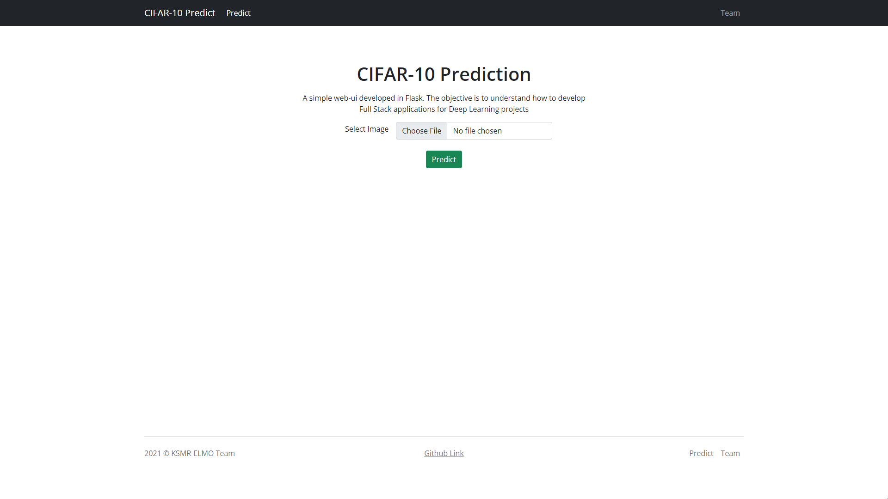
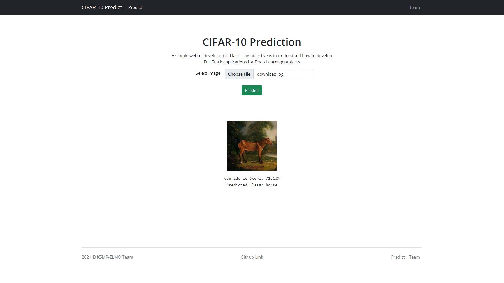

# Flask-PyTorch Introduction

The application is focused towards understanding how to build relation between Websites and Deep Learning applications. In this repository we have developed a web application to classify images into CIFAR-10 categories using ResNet-18 architecture.

The UI and predicted output are displayed in the image below:

 

The UI is hosted on Heroku: <https://flask-pytorch-tutorial1.herokuapp.com/>

To contribute to the project, please read [CONTRIBUTING](./CONTRIBUTING.md) file.

## Contributors

* [Kaustubh Harapanahalli](mailto:kaustubhharapanahalli@gmail.com)
* [Monimoy Deb Purkayastha](mailto:monimoyd@gmail.com)
* [Rohin Sequeira](mailto:sequeira.rohin@gmail.com)
* [Soma Korada](mailto:somakorada@gmail.com)
